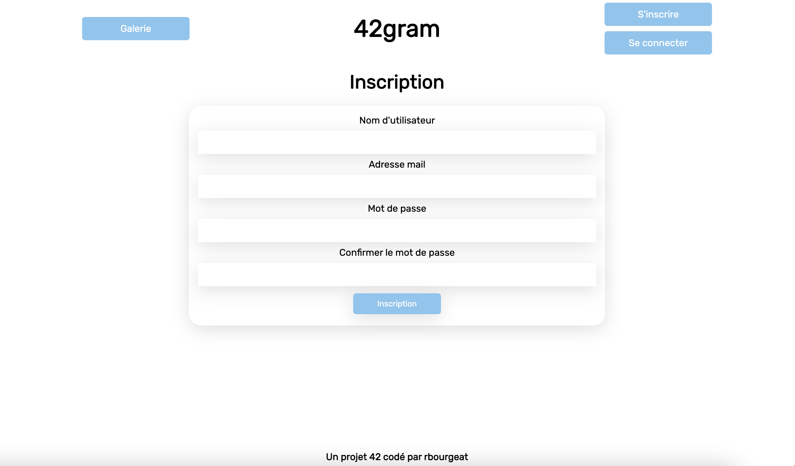
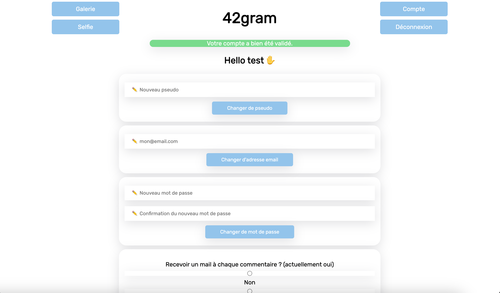
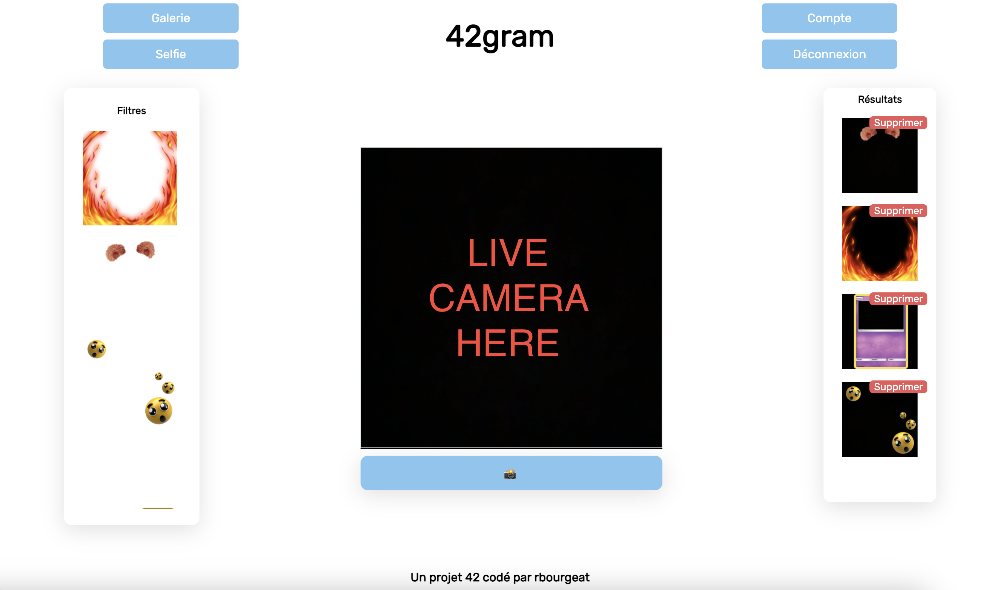
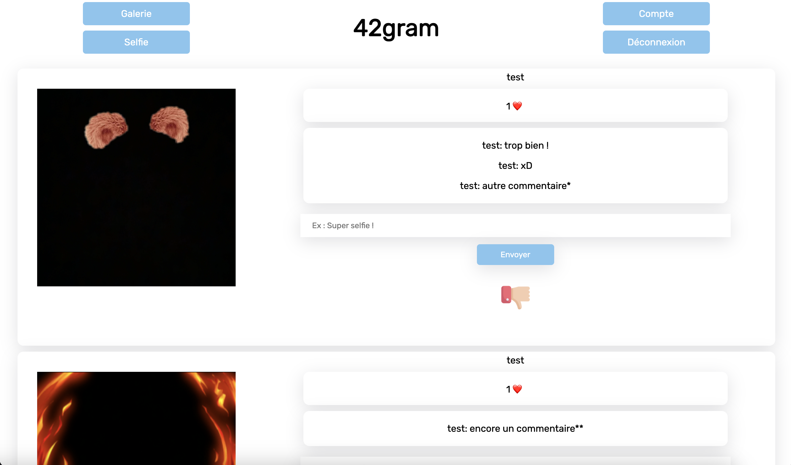

# camagru
Instagram-like in PHP, HTML and JS

## Preview









## Setup ?

Create a `.env` file in the root folder with the following variables (you can edit them):

```
PASS=42rbs3cr3tp4ss
ADMIN=root
```

And edit the file `./config/database.php` with the same variables:

```
$DB_USER = "root";
$DB_PASSWORD = "42rbs3cr3tp4ss";
```

## Start !

Launch the website with the following command:

```
docker-compose up
```
